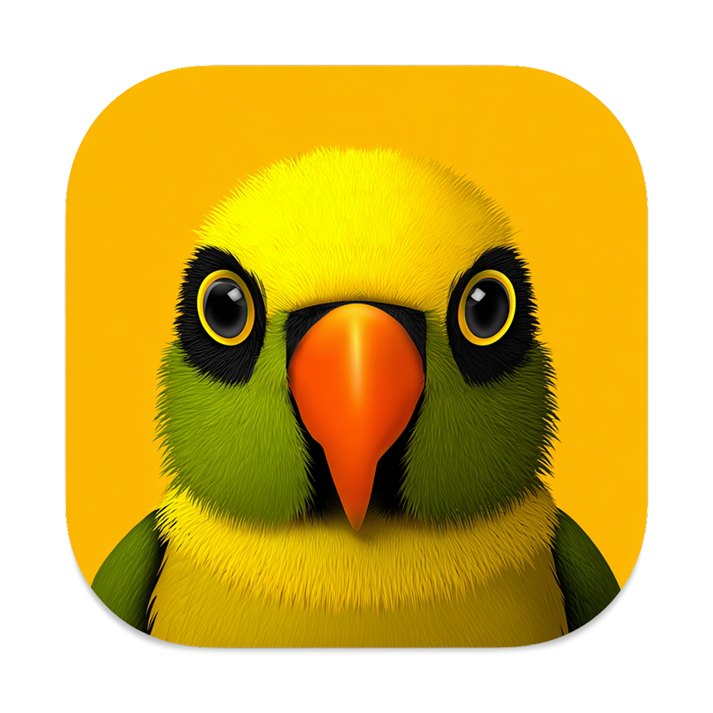

# Burd

[](https://github.com/digitalnodecom/burd/actions/workflows/ci.yml)
[](https://github.com/digitalnodecom/burd/releases)
[](LICENSE)

A local development environment manager for macOS. Run PHP sites, databases, caches, and more with a single app.

Burd provides both a desktop GUI and a powerful CLI to manage FrankenPHP instances, databases, domains with automatic SSL, mail testing, tunnels, and other services — everything you need for local PHP development.



## Features

- **FrankenPHP** instances with per-project PHP configuration
- **Automatic domains** — link any directory to `yoursite.burd` with one command
- **SSL out of the box** — powered by Caddy and mkcert
- **Park directories** — every subdirectory becomes a `.burd` domain automatically
- **Database management** — create, drop, import, export, and shell into databases
- **Project scaffolding** — `burd new laravel myapp` and you're running
- **Environment fixer** — detects `.env` mismatches and fixes them
- **Tunnel sharing** — expose local sites to the internet via frpc
- **Health checks** — `burd doctor` diagnoses common issues
- **MCP server** — `burd mcp` lets AI agents drive Burd
- **Self-updating CLI** — `burd upgrade` pulls the latest release from GitHub

## Requirements

- **macOS** — Apple Silicon (aarch64) and Intel (x86_64) are both supported
- Releases are code-signed and notarized by Apple

## Installation

Download the latest `.dmg` from [Releases](https://github.com/digitalnodecom/burd/releases) and drag Burd to your Applications folder.

The `burd` CLI is also published as a standalone binary — `burd-darwin-aarch64` (Apple Silicon) and `burd-darwin-x64` (Intel) — for use without the desktop app. Once installed, keep it current with:

```bash
burd upgrade
```

## Supported Services

| Service | Default Port | Description |
|---------|-------------|-------------|
| PHP | 8000 | FrankenPHP application server |
| PHP Park | 8888 | Serves every parked directory (one instance) |
| MariaDB | 3330 | SQL database |
| MySQL | 3306 | SQL database |
| PostgreSQL | 5432 | SQL database |
| MongoDB | 27017 | NoSQL database |
| Redis | 6379 | Cache and session store |
| Valkey | 6380 | Redis-compatible alternative |
| Memcached | 11211 | Memory cache |
| Mailpit | 8025 | Local mail testing (SMTP on 1025) |
| Meilisearch | 7700 | Full-text search engine |
| Typesense | 8108 | Full-text search engine |
| MinIO | 9000 | S3-compatible object storage (console on 9001) |
| Beanstalkd | 11300 | Job queue |
| Centrifugo | 8000 | Real-time messaging |
| Bun | 3000 | JS/TS runtime for Node-style projects |
| Gitea | 3000 | Self-hosted Git service |
| Tunnels (frpc) | 7400 | Expose local sites to the internet |
| Caddy Server | 443 | Reverse proxy and SSL (managed internally) |

Local sites resolve on the `.burd` TLD.

## CLI

```bash
# Link a site
cd ~/projects/myapp
burd link myapp          # available at myapp.burd

# Or set up the current directory in one step
burd init

# Create a new project (laravel, wordpress, bedrock)
burd new laravel blog    # scaffolds + links + configures
burd setup               # interactive wizard for an existing project

# Park a directory (every subfolder becomes a .burd domain)
burd park

# Instance control
burd start / stop / restart [name]
burd status
burd logs [name] --follow
burd versions

# Database operations
burd db list
burd db import myapp dump.sql
burd db export myapp
burd db shell myapp
burd db drop myapp

# Native database tools with auto-connection
burd mysql mysqldump mydb
burd postgres psql mydb

# Environment management
burd env check           # compare .env with running services
burd env fix             # interactive fixer

# SSL
burd secure myapp        # enable HTTPS
burd unsecure myapp      # disable HTTPS
burd open myapp          # open in browser

# Proxy non-PHP apps
burd proxy api 3000      # proxy api.burd to localhost:3000
burd unproxy api

# Share with the internet
burd share --subdomain myapp

# Diagnostics and updates
burd doctor              # check services, config, connectivity
burd upgrade             # self-update to latest version

# AI agent integration
burd mcp                 # run the MCP server over stdio
```

Run `burd --help` for the full command reference, or see [docs/CLI.md](docs/CLI.md).

## Documentation

Additional documentation lives in [`docs/`](docs/):

- [CLI reference](docs/CLI.md)
- [SSL certificates](docs/ssl-certificates.md)
- [Update system](docs/UPDATE_SYSTEM.md)

## Development

### Prerequisites

- Node.js 20+
- Rust (stable)
- Xcode Command Line Tools

### Setup

```bash
git clone https://github.com/digitalnodecom/burd.git
cd burd
npm install
npm run tauri dev        # launches the desktop app
```

> `npm run dev` starts the SvelteKit frontend only. Use `npm run tauri dev` to run the actual app.

### Building

```bash
# Desktop app
npm run tauri build

# CLI only
cd src-tauri && cargo build --release --bin burd
```

### Testing

```bash
# Frontend checks (from repo root)
npm run check

# Rust checks
cd src-tauri
cargo fmt --check
cargo clippy -- -D warnings
cargo test
```

## Project Structure

```
burd/
├── src/                    # SvelteKit frontend
│   ├── lib/sections/       # UI sections (instances, domains, services, ...)
│   └── routes/             # Page routes
├── src-tauri/              # Rust backend
│   ├── src/
│   │   ├── cli/            # CLI command implementations
│   │   ├── commands/       # Tauri IPC handlers
│   │   ├── services/       # Service integrations
│   │   └── bin/burd.rs     # CLI binary entry point
│   ├── helper/             # Privileged helper daemon
│   └── services.json       # Service definitions and versions
├── CHANGELOG.md
├── CONTRIBUTING.md
└── LICENSE
```

## Contributing

See [CONTRIBUTING.md](CONTRIBUTING.md) for development setup, coding standards, and the pull request process.

## Security

Found a vulnerability? Please report it privately — see [SECURITY.md](SECURITY.md).

## License

Burd is **source-available, not open source.**

It is licensed under [PolyForm Noncommercial 1.0.0](LICENSE): you may use, modify, and share it freely for **noncommercial purposes only**. Any commercial use is prohibited. See the [LICENSE](LICENSE) for the exact terms.
